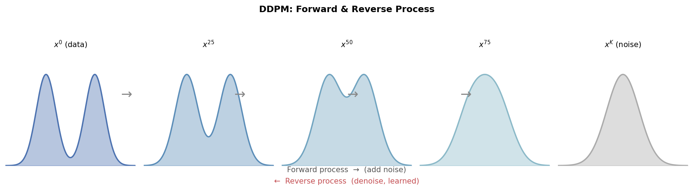
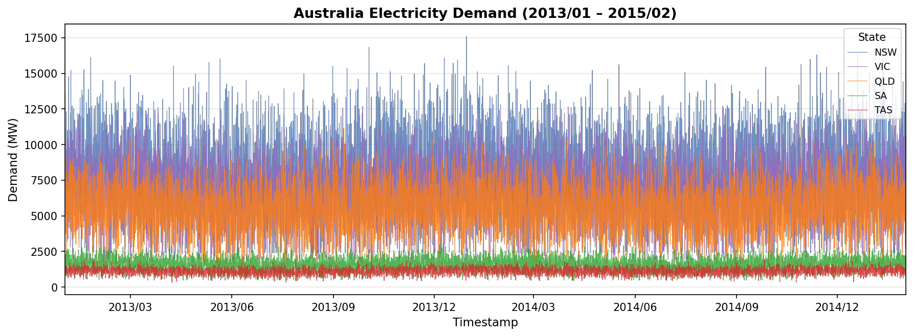
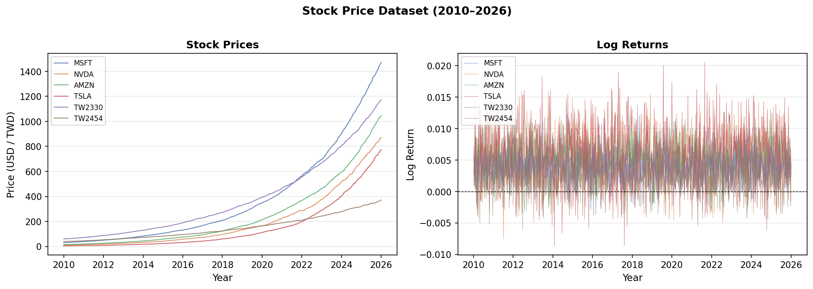

# Forecast Inference for Time Series with TimeGrad Diffusion Model

**Author:** Zi-Wei Hong (洪梓瑋)  
**Advisor:** Prof. Nan-Jung Hsu (徐南蓉 博士)  
**Institution:** Institute of Statistics and Data Science, National Tsing Hua University  
**Degree:** Master's Thesis — July 2025

---

## Overview

This repository contains the implementation and experiments for the master's thesis *"Forecast Inference for Time Series with TimeGrad Diffusion Model"*. The thesis investigates the utility and limitations of diffusion-based generative models — specifically **TimeGrad** — for multivariate time series forecasting and uncertainty quantification.

Traditional models such as Vector Autoregression (VAR) rely on stationarity assumptions that are often violated in real-world data. Deep learning models like RNN and LSTM can handle non-stationary series but cannot easily quantify forecast uncertainty. This work bridges that gap by leveraging **Denoising Diffusion Probabilistic Models (DDPM)** to generate forecast samples, from which full probabilistic inferences (means, quantiles, prediction intervals) are derived.

---

## Background

### Denoising Diffusion Probabilistic Model (DDPM)

DDPM consists of two processes:

- **Forward process**: A manually defined Markov chain that gradually adds Gaussian noise to observed data $x^0$, eventually transforming it into pure Gaussian noise $\mathcal{N}(\mathbf{0}, \mathbf{I})$.
- **Reverse process**: A learned neural network that iteratively removes noise to recover the data distribution, approximating $p_\theta(x^0)$.



The training objective simplifies to minimizing the mean squared error between the true added noise $\epsilon$ and the model's noise prediction $\epsilon_\theta$:

$$L_{\text{simple}}(\theta) = \mathbb{E}_{k,\, x^0,\, \epsilon} \left[\left\| \epsilon - \epsilon_\theta\left(\sqrt{\widetilde{\alpha}_k}x^0 + \sqrt{1 - \widetilde{\alpha}_k} \epsilon,\; k\right) \right\|^2 \right]$$

### TimeGrad

TimeGrad (Rasul et al., 2021) extends DDPM to **multivariate probabilistic time series forecasting** by conditioning the noise prediction network on a hidden state $h_{t-1}$ produced by an RNN module encoding historical observations and covariates:

$$h_t \leftarrow \text{RNN}_\theta\left(\left[x^0_t, c_t \right]^\top, h_{t-1}\right)$$

The conditional forecast distribution is factorised autoregressively:

$$p_\theta(x^0_{t_0+1:T} \mid x^0_{1:t_0}, c_{1:T}) = \prod_{t=t_0+1}^{T} p_\theta(x^0_t \mid h_{t-1})$$

The sampling procedure generates $S$ independent forecast trajectories, providing a Monte Carlo approximation of the full predictive distribution.

---

## Forecast Inferences
 
Given $S$ generated samples $\lbrace x_{t,s} : s = 1, \ldots, S \rbrace$ at each forecast step $t$, the following inferences are computed:
 
**Forecast mean:**
 
$$\bar{x}_t = \frac{1}{S} \sum_{s=1}^{S} x_{t,s}$$
 
**$100\tau$%-th quantile** (order statistic of sorted samples):
 
$$Q_t^{*}(\tau) = x_{t,\,(\lfloor S\tau \rfloor)}$$
 
**Forecast median:** 

$$Q_t^{*}(0.5)$$
 
**$100\tau$% prediction interval:** 

$$\left( Q_t^{\ast}\left(\frac{1-\tau}{2}\right), Q_t^{\ast}\left(\frac{1+\tau}{2}\right) \right)$$

### Extreme Quantile Estimation via GPD

Because sample quantiles are bounded by the sample minimum and maximum, the **Generalised Pareto Distribution (GPD)** is fitted to the tails of the generated samples to extrapolate extreme quantiles (e.g., 0.5% and 99.5%), enabling more reliable tail inference.

### Evaluation Metrics

- **CRPS** (Continuous Ranked Probability Score)
- **Square Error** (based on forecast mean)
- **Absolute Error** (based on forecast median)
- **Forecast Interval Width** and **Coverage** at 50%, 95%, and 99% levels

---

## Data Applications

### 1. Australia Electricity Dataset

- **Target series**: Half-hourly electricity demand (MW) across 5 Australian states (NSW, QLD, SA, TAS, VIC) from January 2013 to February 2015.
- **Covariates**: Time-of-day and day-of-week features.
- **Setup**: Training on the first 7 weeks ($t_0 = 336$), forecasting the 8th week ($T = 384$; 48 steps per day).



**Key findings:**
- VAR outperforms TimeGrad on all point-forecast and interval metrics for this stationary, periodic dataset.
- TimeGrad's forecast interval widths remain **constant over the forecast horizon**, whereas VAR's intervals widen over time.
- Despite wider intervals, TimeGrad achieves **lower coverage** than VAR, indicating miscalibration.

### 2. Stock Price Dataset

- **Target series**: Weekly closing prices of 6 stocks — MSFT, NVDA, AMZN, TSLA, TW2330 (TSMC), TW2454 (MediaTek) — from 2010 to 2026.
- **Setup**: Training on 5 weeks ($t_0 = 25$), forecasting the next week ($T = 30$).
- **Two modelling approaches**: modelling raw prices directly, and modelling log returns with reconstruction.



**Key findings:**
- VAR performs poorly on raw prices due to non-stationarity; coverage collapses to near 0.
- TimeGrad handles non-stationary prices well, achieving high coverage (≥ 99% at the 99% level).
- TimeGrad's forecast intervals are substantially wider than VAR's across all stocks and confidence levels.
- TimeGrad becomes **unstable** when applied to reversed log returns for some stocks, producing extremely wide intervals.

---

## Results Summary

### Australia Electricity Dataset

| Model | CRPS | Square Error | Absolute Error | 95% Coverage | 99% Coverage |
|-------|------|-------------|----------------|:------------:|:------------:|
| VAR | 458.84 ± 339.12 | 210,695 ± 374,241 | 458.84 ± 339.12 | 0.93 ± 0.13 | 0.97 ± 0.09 |
| TimeGrad | 964.51 ± 308.81 | 699,474 ± 445,859 | 1,250.75 ± 348.32 | 0.67 ± 0.09 | 0.79 ± 0.08 |
| TimeGrad + GPD | — | — | — | — | 0.80 ± 0.08 |

### Stock Price Dataset (Coverage)

| Model | Method | 50% Coverage | 95% Coverage | 99% Coverage |
|-------|--------|:------------:|:------------:|:------------:|
| VAR | Original | 0.037 | 0.087 | 0.102 |
| VAR | Reversed | 0.504 | 0.867 | 0.927 |
| TimeGrad | Original | 0.741 | 0.967 | 0.991 |
| TimeGrad | Reversed | 0.849 | 0.999 | 1.000 |

---

## Implementation Details

| Hyperparameter | Value |
|---------------|-------|
| Noise schedule | Linear, $\alpha_1 = 0.9999$ to $\alpha_{100} = 0.9$ |
| Diffusion steps $K$ | 100 |
| Generated samples $S$ | 1,000 |
| Batch size | 64 |
| Learning rate | $10^{-4}$ |
| Optimizer | Adam ($\beta_1 = 0.9$, $\beta_2 = 0.999$, $\delta = 10^{-7}$) |
| Max epochs | 50 (early stopping after 5 epochs without improvement) |

### Execution Time

| Model | AUS Elec. Training | AUS Elec. Sampling | Stock Training | Stock Sampling |
|-------|:-----------------:|:-----------------:|:--------------:|:--------------:|
| VAR | 1:35:56 | 0:10 | 0:01 | 0:01 |
| TimeGrad | 0:34:51 | 1:23:20 | 1:17 | 5:50 |

---

## Discussion

**Why does TimeGrad underperform on the electricity dataset?**

1. The RNN module may fail to adequately encode long-range historical dependencies.
2. The electricity dataset, while large, is still relatively small for a deep learning model with many parameters.

**Areas for future improvement:**

1. **Narrowing forecast intervals** — TimeGrad consistently produces wider intervals than VAR even when achieving lower coverage; calibration methods (e.g., conformal prediction) could help.
2. **Faster sampling** — Sampling 1,000 trajectories over 100 diffusion steps is computationally expensive (over 1 hour for the electricity dataset). Accelerated samplers (DDIM, DPM-Solver) could reduce this dramatically.
3. **Identifiability of covariates** — Future work will investigate whether the covariate encoding is identifiable, i.e., whether different covariate configurations lead to distinguishable model behaviours.

---

## Repository Structure

```
.
├── README.md
├── figures/
│   ├── ddpm_process.png               # DDPM forward & reverse process diagram
│   ├── electricity_demand.png         # Australia Electricity Dataset overview
│   └── stock_prices.png               # Stock Price Dataset overview
└── 洪梓瑋口試簡報.pdf                   # Thesis defence presentation slides
```

---

## References

- Ho, J., Jain, A., and Abbeel, P. (2020). *Denoising diffusion probabilistic models.* Advances in Neural Information Processing Systems, 33:6840–6851.
- Rasul, K., Seward, C., Schuster, I., and Vollgraf, R. (2021). *Autoregressive denoising diffusion models for multivariate probabilistic time series forecasting.* International Conference on Machine Learning, pp. 8857–8868.
- Kingma, D. P. and Ba, J. (2015). *Adam: A method for stochastic optimization.* ICLR 2015.
- Lütkepohl, H. (2005). *New Introduction to Multiple Time Series Analysis.* Springer.
